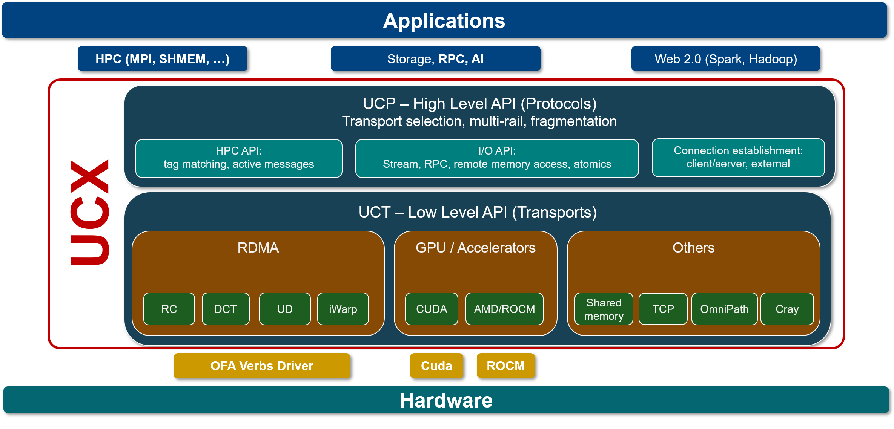

..
.. Copyright (C) Mellanox Technologies Ltd. 2019.  ALL RIGHTS RESERVED.
.. Copyright (C) Arm Ltd. 2021.  ALL RIGHTS RESERVED.
..
.. See file LICENSE for terms.
..

*******
OpenUCX
*******

Unified Communication X (UCX) is an `award winning <https://losalamosreporter.com/2019/11/07/nine-los-alamos-national-laboratory-projects-win-rd-100-awards>`_,
optimized production-proven communication framework for modern, high-bandwidth
and low-latency networks.

UCX exposes a set of abstract communication primitives that utilize the best of
available hardware resources and offloads. These include RDMA (InfiniBand and RoCE),
TCP, GPUs, shared memory, and network atomic operations.

UCX facilitates rapid development by providing a high-level API, masking the
low-level details, while maintaining high-performance and scalability.

UCX implements best practices for transfer of messages of all sizes, based on
accumulated experience gained from applications running on the world's largest
datacenters and supercomputers. The full list of features and capabilities can
be found :ref:`here<ucx_features>`.

UCX is a member of `UCF consortium <https://www.ucfconsortium.org>`_.

.. toctree::
   :maxdepth: 3
   :hidden:

   ucx_features
   download
   running
   api
   faq
   glossaries

Quick start
***********

The following commands will download UCX latest v{RELEASE} release, build the code,
and run a simple client/server example:

.. code-block:: console

    $ wget https://github.com/openucx/ucx/releases/download/v{RELEASE}/ucx-{RELEASE}.tar.gz
    $ tar xzf ucx-{RELEASE}.tar.gz
    $ cd ucx-{RELEASE}
    $ ./contrib/configure-release --prefix=$PWD/install
    $ make -j8 install

    $ gcc examples/ucp_client_server.c -lucp -lucs -o ucp_client_server \
          -Iinstall/include -Linstall/lib
    $ export LD_LIBRARY_PATH=$PWD/install/lib
    $ ./ucp_client_server &
    $ ./ucp_client_server -a <ip-addr>   # <ip-addr>: IP address of a local RoCE or IPoIB interface
    ...
    ----- UCP TEST SUCCESS -------

    UCX Client-Server Hello World

    ------------------------------

Projects using UCX
******************

* `UCX-PY <https://ucx-py.readthedocs.io/en/latest>`_
* `Dask <https://blog.dask.org/2019/06/09/ucx-dgx>`_
* `SparkUCX <https://github.com/openucx/sparkucx>`_
* `NCCL <https://developer.nvidia.com/nccl>`_
* `OpenMPI <https://www.open-mpi.org>`_
* `MPICH <https://www.mpich.org>`_
* `Charm++ <https://www.hpccharm.com>`_
* `OSSS shmem <https://github.com/openshmem-org/osss-ucx>`_
