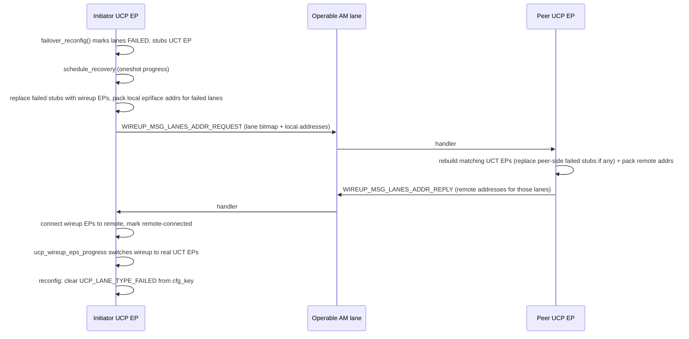

## Goal

Make `test_ucp_fault_tolerance.target_failure_and_recovery` pass: after failover, `ucp_ep_get_failed_lanes(ep)` must become 0, all wireup EPs must be replaced by real UCT EPs, and AM operations must succeed again.

## High-level flow



## Files and key edit points

### 1. Schedule recovery after failover

`[src/ucp/core/ucp_ep.c](src/ucp/core/ucp_ep.c)` - in `ucp_ep_failover_reconfig()` (around line 1730) after `ucp_ep_discard_lanes(...)`, schedule a one-shot recovery progress per EP:

```c
ucp_ep_discard_lanes(ucp_ep, failed_lanes, discard_status, old_cfg_index);
ucp_ep_recovery_schedule(ucp_ep);
```

No extra per-EP state is needed. The set of failed lanes is already expressed by `UCP_LANE_TYPE_FAILED` in `ucp_ep_config(ep)->key.lanes[lane].lane_types`, and `ucp_ep_get_failed_lanes(ep)` (see `[src/ucp/core/ucp_ep.inl](src/ucp/core/ucp_ep.inl)`) reads it on demand. Recovery progress and the reply handler both consult that directly, and reconfigure to clear the bits when a lane is recovered. Duplicate scheduling is avoided with a simple `ucs_callbackq_add_oneshot` predicate (same pattern as `ucp_wireup_msg_ack_cb_pred`).

### 2. Recovery initiator driver

New file `src/ucp/wireup/wireup_recovery.c` (or a new section in `wireup.c`) exposing:

- `void ucp_ep_recovery_schedule(ucp_ep_h ep)` - registers oneshot callback on `worker->uct->progress_q`, similar to `ucp_wireup_eps_progress_sched()`.
- `static unsigned ucp_ep_recovery_progress(void *arg)` - the actual work, fully driven off `ucp_ep_get_failed_lanes(ep)`:
  1. Bail out if `ep->flags & UCP_EP_FLAG_FAILED`, or `cfg_key.am_lane == UCP_NULL_LANE`, or `ucp_ep_get_failed_lanes(ep) == 0` (already recovered by a previous progress/reply).
  2. For each lane in `ucp_ep_get_failed_lanes(ep)`:
     - Get the failed-stub UCT EP via `ucp_ep_get_lane(ep, lane)`.
     - Create a new wireup EP with `ucp_wireup_ep_create()`, set it as the lane via `ucp_ep_set_lane()`. The failed-stub is discarded via `ucp_ep_failed_destroy()`.
  3. Pack ep/iface addresses for the failed-lane rscs using `ucp_address_pack()` with a tl_bitmap limited to `ucp_wireup_get_ep_tl_bitmap(ep, failed_lanes)` plus the RECOVERY header (see below).
  4. Send `UCP_WIREUP_MSG_LANES_ADDR_REQUEST` via `ucp_wireup_msg_send()`-like path but using `ep_config->key.am_lane` as the send lane (the operable AM lane post-failover). The message carries the lane masks so the peer and reply handler both know which lanes are in play without any EP-local bookkeeping.

### 3. New wireup message types

`[src/ucp/wireup/wireup.h](src/ucp/wireup/wireup.h)` - add generic lane-address exchange messages (intentionally not named "recovery" so they can be reused later, e.g. on-demand lane connection):

```c
UCP_WIREUP_MSG_LANES_ADDR_REQUEST,
UCP_WIREUP_MSG_LANES_ADDR_REPLY,
```

Extend `ucp_wireup_msg_t` with two distinct lane masks plus the lane mapping:

- `requested_lane_map` - the lanes the initiator asked for addresses of (set in REQUEST, echoed in REPLY).
- `provided_lane_map` - the subset the sender actually carries addresses for in this message (in REQUEST: which lanes the initiator managed to allocate wireup EPs and pack addresses for; in REPLY: which lanes the peer could actually connect to and pack remote addresses for).
- `lanes2remote[UCP_MAX_LANES]` - only valid entries for `provided_lane_map`.

The two masks decouple "what was asked" from "what is provided", so both sides can drop or re-request the lanes that didn't make it through. This is the same mechanism we'll want for an on-demand lane connection flow later.

Update `ucp_wireup_msg_str()` and the send/pack path in `ucp_wireup_msg_progress()` to allow sending LANES_ADDR messages strictly via `key.am_lane`.

### 4. Peer-side handler

`[src/ucp/wireup/wireup.c](src/ucp/wireup/wireup.c)` - in `ucp_wireup_msg_handler()` dispatch:

- `UCP_WIREUP_MSG_LANES_ADDR_REQUEST` -> new `ucp_wireup_process_lanes_addr_request()`:
  1. Look up local UCP EP by `dst_ep_id`.
  2. Start with `peer_provided = 0`. For each lane in the incoming `provided_lane_map`:
     - If the peer's lane is a failed stub, replace it with a wireup EP (same as initiator step 2.2).
     - Attempt `ucp_wireup_connect_lane_to_iface()` / `ucp_wireup_connect_lane_to_ep()` against the provided remote address for that lane. On success, set `peer_provided |= UCS_BIT(lane)`. On any failure (alloc, select, connect), leave the lane marked FAILED and skip it.
  3. Pack local addresses only for lanes in `peer_provided` and send `UCP_WIREUP_MSG_LANES_ADDR_REPLY` with `requested_lane_map = <incoming requested>` and `provided_lane_map = peer_provided`.
  4. Call `ucp_ep_reconfig_clear_failed_lanes(ep, peer_provided)` to flip the FAILED bit off only for the lanes that actually came back. Lanes in `requested \ peer_provided` stay FAILED - partial recovery is a legal steady state.

- `UCP_WIREUP_MSG_LANES_ADDR_REPLY` -> new `ucp_wireup_process_lanes_addr_reply()`:
  1. Compute `to_complete = msg->provided_lane_map & ucp_ep_get_failed_lanes(ep)` (still-failed lanes for which the peer sent a remote address).
  2. `ucp_wireup_connect_local()` variant restricted to `to_complete` using the provided `lanes2remote`.
  3. Scoped `ucp_wireup_update_flags_masked(ep, to_complete, UCP_WIREUP_EP_FLAG_READY | UCP_WIREUP_EP_FLAG_REMOTE_CONNECTED)` - only these wireup EPs get swapped.
  4. Call `ucp_wireup_eps_progress_sched(ep)` so the existing progress swaps proxies for real UCT EPs.
  5. Call `ucp_ep_reconfig_clear_failed_lanes(ep, to_complete)` to clear the FAILED bit for exactly the lanes we just recovered.
  6. Lanes in `msg->requested_lane_map \ msg->provided_lane_map` (peer gave up on them) and any lane whose `connect_local` call failed stay FAILED. The next failover event, or an explicit follow-up `ucp_ep_recovery_schedule()` call at the tail of this handler, will re-drive recovery for whatever remains in `ucp_ep_get_failed_lanes(ep)`.

### 5. Clearing UCP_LANE_TYPE_FAILED (partial-safe)

Add `ucp_ep_reconfig_clear_failed_lanes(ep, lanes)` in `[src/ucp/core/ucp_ep.c](src/ucp/core/ucp_ep.c)` with these properties:

- `lanes` is any subset of the currently failed lanes; it does not have to be all of them.
- Copy `ucp_ep_config(ep)->key`, turn off `UCS_BIT(UCP_LANE_TYPE_FAILED)` in `cfg_key.lanes[lane].lane_types` for each lane in `lanes & ucp_ep_get_failed_lanes(ep)`. Lanes outside that intersection are left untouched.
- Re-run the `am_lane` selection from `ucp_ep_reconfig_internal()` (lines 1693-1708 in `[src/ucp/core/ucp_ep.c](src/ucp/core/ucp_ep.c)`) so that if the currently-operable AM lane was a post-failover fallback and one of its original candidates just came back, we can promote it again.
- Call `ucp_worker_get_ep_config()` + `ucp_ep_set_cfg_index()` + `ucp_ep_config_reactivate_worker_ifaces()` just like `ucp_ep_reconfig_internal()` / `ucp_ep_update_rkey_config()` do.
- If `cfg_key` ends up identical to the current key (e.g. all requested lanes were already cleared by an earlier partial pass), this is a no-op.

This helper is what makes partial recovery safe: after it runs, `ucp_ep_get_failed_lanes(ep)` reflects exactly the still-failed subset, so the next scheduled recovery pass (or a future failover) can re-attempt only those lanes.

### 6. Keepalive / safety

- `ucp_worker_keepalive_add_ep(ep)` is already idempotent; re-invoke it after recovery so the recovered EP resumes keepalive.
- `ucp_ep_check_lanes()` assertion that currently tolerates failed UCT EPs only in FAILOVER mode remains correct - recovery runs under FAILOVER only.

## Scope of this POC

### In scope

- `UCT_IFACE_FLAG_CONNECT_TO_IFACE` transports - `dc_mlx5`, `ud`, `self`, `tcp` in iface mode, etc. These are the primary targets and are exercised by the current test matrix (e.g. the `dc_x` path referenced in `test_am_with_injected_failure`).
  - Both the initiator's `ucp_ep_recovery_progress` and the peer's `ucp_wireup_process_lanes_addr_request` call into `ucp_wireup_connect_lane_to_iface()`, which creates a brand-new real UCT EP from the remote iface address carried in the `LANES_ADDR_REQUEST` / `REPLY`. This is the same path normal wireup uses for iface-connect transports, so recovery reuses it unchanged.
  - Address packing for these lanes is trivial: the initiator just needs the resource's iface address, no inner p2p EP is required.

### Partially in scope (design is extendable but not implemented in this POC)

- True p2p transports (`UCT_IFACE_FLAG_CONNECT_TO_EP`, e.g. `rc_mlx5`). The wire protocol (`LANES_ADDR_REQUEST` / `REPLY` with `requested_lane_map`, `provided_lane_map`, `lanes2remote`) already matches the shape of a p2p exchange, and `ucp_wireup_process_lanes_addr_reply` already routes through `ucp_wireup_connect_local()` which supports p2p. The extension points needed later:
  1. In `ucp_ep_recovery_progress`, for each p2p failed lane, eagerly create the inner UCT EP via `ucp_wireup_connect_lane_to_ep()` (not just the wireup proxy) so its EP address can be packed into `LANES_ADDR_REQUEST`. For CONNECT_TO_IFACE lanes we skip this step - only the iface address is packed.
  2. The peer handler must likewise run `ucp_wireup_connect_lane_to_ep()` when the lane's transport is p2p and reply with that lane's local EP address.
  3. A subsequent `ACK`-like phase or reuse of the existing `UCP_EP_FLAG_LOCAL_CONNECTED` handshake to finalize p2p readiness.
- These hooks fall naturally out of the two-mask protocol already in the plan and do not require a wire-format change.

### Out of scope

- Configs with **no** CONNECT_TO_IFACE lane available and no aux transport reachable for p2p bootstrap - recovery has no operable channel in that case and must surface as a hard EP failure (same as today when `cfg_key.am_lane == UCP_NULL_LANE`, which the `ucp_ep_recovery_progress` bail-out already handles).
- CM (sockaddr) flow: already disabled by `ucp_ep_failover_reconfig()`; we mirror that.
- Retrying a `LANES_ADDR_REQUEST` that is lost in flight: we rely on the next keepalive-/IO-driven failure detection to re-enter `ucp_ep_failover_reconfig()` and reschedule recovery (future work).

## Test plan

- Build UCX with the new code and run `test/gtest/ucp/test_ucp_fault_tolerance.target_failure_and_recovery`.
- Verify existing FT tests (`initiator_failure`, `target_failure` without recovery) still pass - they never mark `TEST_OP_RECOVERY`, so the new path must be a no-op for them beyond scheduling.
- Run the full `test_ucp_fault_tolerance.*` matrix to catch regressions.
